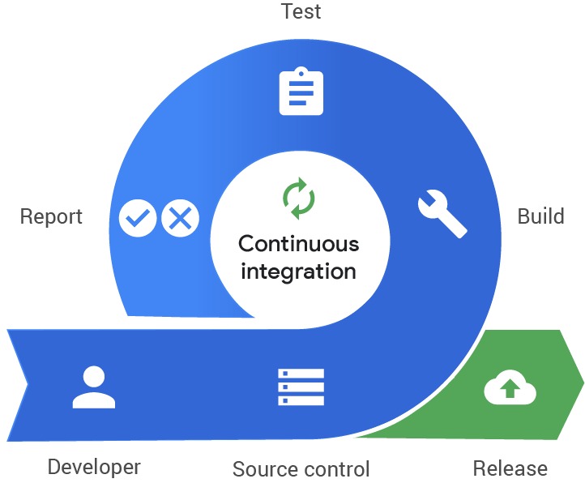

# OPA! Oversight for Terraform 0.12 workflows

{ width=25% }

(With terrible 1990s website design by PanDoc)

## Background (or why are we here?)

---

Congrats! We've acheived DevOps Nirvana! We have disparate technologists building and owning their own infrastructure for the apps they're working on! 

{ width=50% }

---

And better yet, those configurations are hosted in the same repos that the application code is! And those technologists are working on new and interesting things with the infrastructure!  Everything is running smoothly at speed and at scale, your users are happy and features are coming, velocity is high! The monoliths of yesterTuesday are a distant memory.

{ width=50% }

---

But there's some big issues with having such a disparate system, while we trust people to know what they want to do, people can do things that aren't compliant, or aren't secure, or are just a local antipattern.

So how do you give everyone the safeguards to say "Don't, Stop, Come back!"

{ width=50% }

## Enter CI tools

---

Of course the answer is CI tooling, this is a DevOps talk, you'd be sad otherwise, right? Otherwise we'd have to talk about systemic cultural change and really you should go and watch talks about that(There's a shameless plug about watching DevOpsDays Rockies talks here somewhere).

[{ width=25% }](https://www.youtube.com/channel/UCwFMoE8ew8lGHQXuiA3fy2A)<figcaption>Gratuitously liberated from Google Cloud</figcaption>

## Open Policy Agent

---

So, we've gotten through the premise, now onto what the talk's about.

What is the Open Policy Agent?

* A Cloud Native Foundation Incubating project
  * A bit alpha
* A general-purpose policy engine with uses ranging from authorization and admission control to data filtering (from OPA docs)
* Basically a JSON/YAML validater 🤷‍♀️

---

